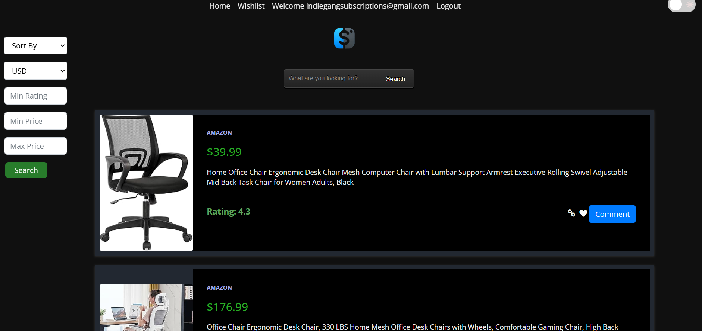
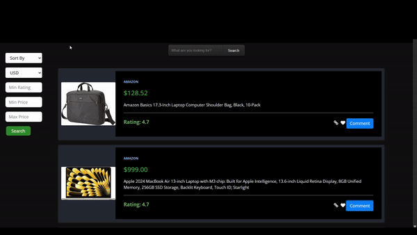

# SLASH
Slash Your Spending, Not Your Style - Unleash the Best Deals!!

<p align="center"></p>

[](https://github.com/SE-Fall-2024-Team-69/slash/blob/main/LICENSE)
[](https://doi.org/10.5281/zenodo.14029366)

[](https://github.com/SE23-Team44/slash/actions/workflows/pylint.yml)
[](https://github.com/SE23-Team44/slash/actions/workflows/python-package.yml)
[](https://github.com/SE23-Team44/slash/actions/workflows/code_cov.yml)
[](https://github.com/SE-Fall-2024-Team-69/slash/actions/workflows/python-package.yml)
[](https://github.com/SE-Fall-2024-Team-69/slash/actions/workflows/style_checker.yml)
[](https://github.com/SE-Fall-2024-Team-69/slash/actions/workflows/code_formatter.yml)

[](https://github.com/SE23-Team44/slash/issues)
[](https://github.com/SE23-Team44/slash/issues?q=is%3Aissue+is%3Aclosed)
[](https://github.com/SE23-Team44/slash/pulls?q=is%3Apr+is%3Aclosed)
<a href="https://github.com/SE23-Team44/slash/network"></a>
<a href="https://github.com/SE23-Team44/slasg/stargazers"></a>


Slash is a powerful tool designed to scrape leading e-commerce websites to find the best deals on products you're searching for. It currently supports popular platforms including [Walmart](https://www.walmart.com/), [Target](https://www.target.com/), [BestBuy](https://www.bestbuy.com/),  [Amazon](https://www.amazon.com/), [Google Shopping](https://shopping.google.com/),  [BJs](https://www.bjs.com/),  [Etsy](https://www.etsy.com/), and [EBay](https://www.ebay.com/).
- **Fast**: With slash, you can save over 50% of your time by comparing deals across websites within seconds
- **Easy**: Slash uses very easy commands to filter, sort and search your items
- **Powerful**: Quickly alter the commands to get desired results

# :rocket: Quick Guide

1. Access the Github repository from your computer. 
 - First, pre-install [git](https://git-scm.com/) on  your machine. 
 - Then, clone the repo using the following command:
 ```
 git clone https://github.com/SE-Fall-2024-Team-69/slash.git
 ```
 * Finally, ```cd``` into the local repository.
```
cd slash
```
2. Install the ```requirements.txt```. 
- This project uses Python 3, so make sure that [Python](https://www.python.org/downloads/) and [Pip](https://pip.pypa.io/en/stable/installation/) are preinstalled.
- Install the ```requirements.txt``` file using pip.
```
pip3 install -r requirements.txt
```
3. Running the program

- Set the environmental variable using either of the following commands:
 ```
MAC
export FLASK_APP=./src/modules/app
flask run

Windows Command Prompt
set FLASK_APP=.\src\modules\app 
flask run

Windows Powershell
$Env:FLASK_APP='.\src\modules\app'
flask run
```

4. Once flask is running, open your internet browser and type ```http://127.0.0.1:5000/``` into the search bar.

<p>
 
# :dizzy: What's New? (Project 3 Updates)

### Enhanced UI

New grid UI with product images for a smoother shopping experience.  

<p align="center"></p>  


Now we can add and read comments for more informed decisions.  

<p align="center"></p>  


### User login with Google OAuth   
 
<p align="center"></p>


:movie_camera: Checkout our demo video
---

[Click for Demo Video](https://drive.google.com/file/d/1Efehn_X6z4WYxklG2uGirg7ytlanE8Hl/view)


# :muscle: What's next for future development?

- Coupon Scraping: Incorporate coupon scraping functionality to help users save even more by automatically finding and applying available discounts.
- Expanded Scraper Coverage: Add more scrapers to cover a wider range of e-commerce websites, offering users more options and better deals across various platforms.


:thought_balloon: Use Case
---
* ***Students***: Students coming to university are generally on a budget and time constraint and generally spend hours wasting time to search for products on Websites. Slash is the perfect tool for these students that slashes all the unnecessary details on a website and helps them get prices for a product across multiple websites.Make the most of this tool in the upcoming Black Friday Sale.
* ***Data Analysts***: Finding data for any project is one of the most tedious job for a data analyst, and the datasets found might not be the most recent one. Using slash, they can create their own dataset in real time and format it as per their needs so that they can focus on what is actually inportant.
  
# Additional Information
 For Additional Information direct to this [page](https://github.com/SE-Fall-2024-Team-69/slash/tree/main/docs)  and check all the markdown files 


:sparkles: Contributors
---
<table>
  <tr>
    <td align="center"><a href="https://github.com/yaswanth67"><br /><sub><b>Yaswanth Baddi</b></sub></a><br /></td>
    <td align="center"><a href="https://github.com/YaswanthMullamuri"><br /><sub><b>Yaswanth Mullamuri</b></sub></a><br /></td>
    <td align="center"><a href="https://github.com/AyushGupta-Code"><br /><sub><b>Ayush Gupta</b></sub></a></td>
  </tr>
</table>
